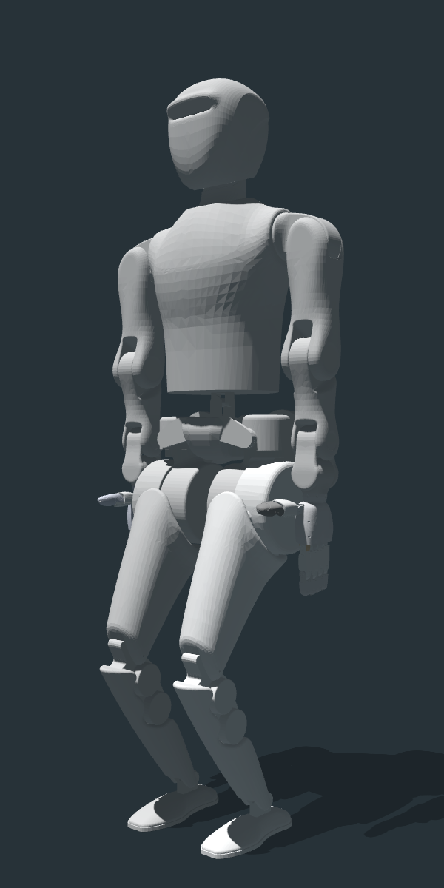

# STAR1 Robot URDF Description

This repository contains the URDF description of the humanoid robot STAR1, developed by RobotEra, a leading company in humanoid robotics.

## Overview

- The robot has a total of 55 degrees of freedom (DOF), including the following parts:
  

  - Legs: 6 DOF × 2 = 12 DOF
  - Arms: 7 DOF × 2 = 14 DOF
  - Hands: 12 DOF × 2 = 24 DOF
  - Waist: 3 DOF
  - Head: 2 DOF

- When the robot is fully upright, the joint angles of the legs are as follows:

| Joint Name                 | Angle (degrees) |
|----------------------------|:---------------:|
| left_hip_pitch_joint       |        30       |
| left_knee_joint            |       -60       |
| left_ankle_pitch_joint     |        30       |
| right_hip_pitch_joint      |        30       |
| right_knee_joint           |       -60       |
| right_ankle_pitch_joint    |        30       |
| Other leg joints           |         0       |

## Support & Contact

For technical support or business inquiries:
- Email: support@robotera.com
- Create an issue in this repository

## About RobotEra

RobotEra is dedicated to advancing humanoid robotics technology. Our XBot series includes:
- XBot-S: 1.2-meter tall humanoid robot
- XBot-L: 1.65-meter tall humanoid robot

We specialize in developing robust and versatile humanoid robots for real-world applications, with a focus on reliable sim-to-real transfer capabilities. 